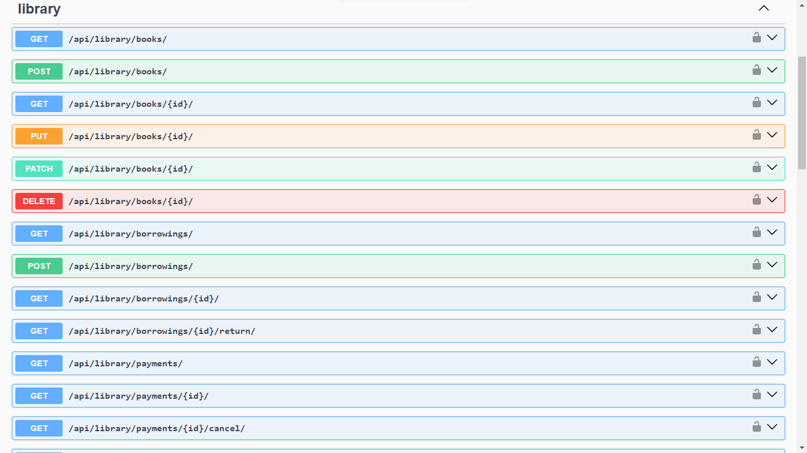
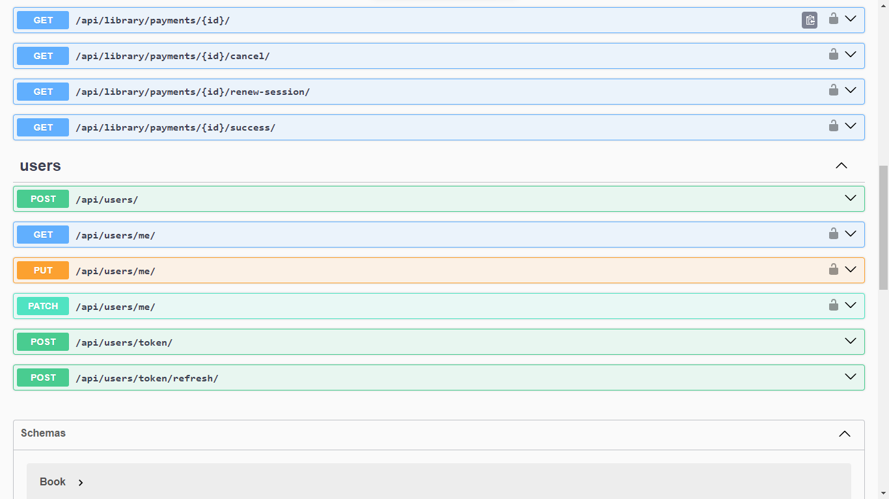
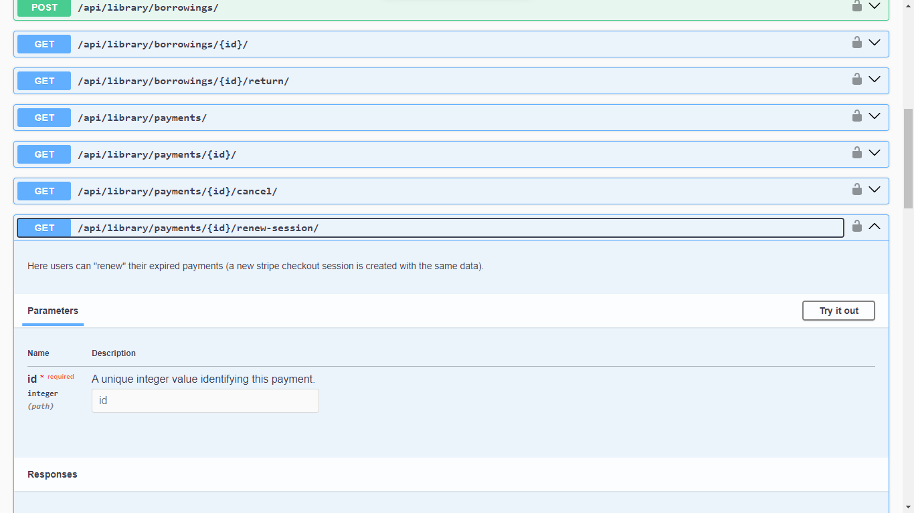
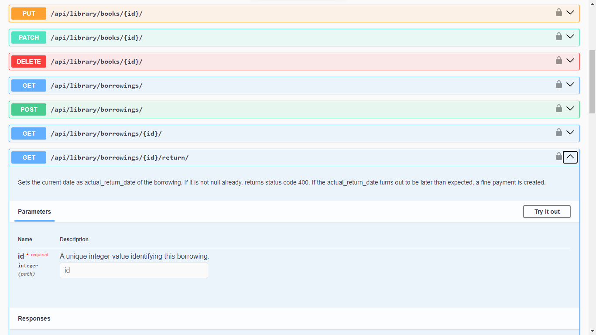
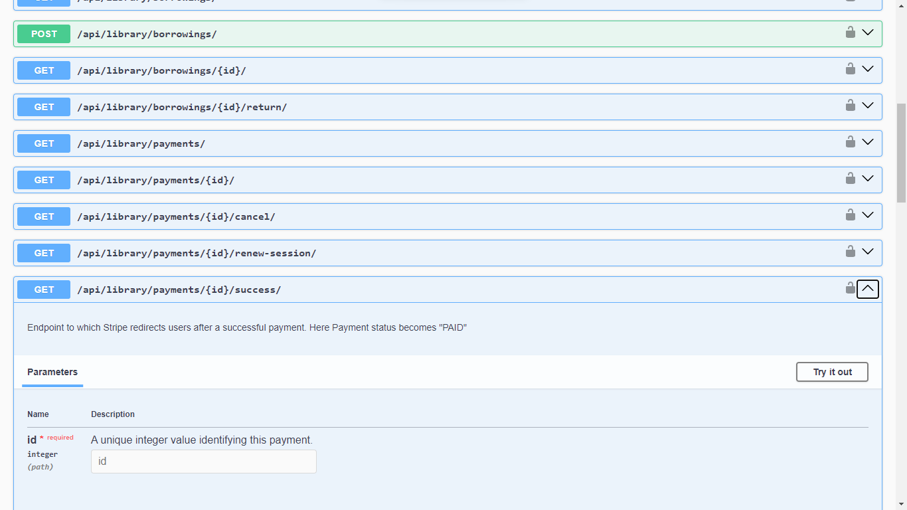

# Library API
Restful Django project for managing a library.

## Features
- JWT Authentication
- Payments management (Stripe API)
- Borrowings management
- Book management
- Fines system
- Telegram notifications


## Installation
### Docker should be installed
```bash
git clone https://github.com/sashabryl/library-api.git
cd library-api
cp .env.sample .env
docker-compose build
docker-compose up
```

## Telegram notifications group
### To join the group go to https://t.me/library_notifications321

## Testing
### To run tests, type:
```bash
docker exec -it <id of the docker container with the app> python manage.py test
```
## Endpoints

### Books Service (CRUD for Books)
- POST:         api/library/books/             - add a new book 
- GET:          api/library/books/              - get a list of books
- GET:          api/library/books/{id}/      - get book's detail info 
- PUT/PATCH:    api/library/books/{id}/      - update book (also manage inventory)
- DELETE:       api/library/books/{id}/      - delete book

### Users Service (Authentication & registration management)
- POST:           api/users/                       - register a new user 
- POST:           api/users/token/                 - get JWT tokens 
- POST:           api/users/token/refresh/    - refresh JWT token 
- GET:            api/users/me/               - get my profile info 
- PUT/PATCH:      api/users/me/           - update profile info 

### Borrowings Service (Book borrowings management)
- POST:            api/library/borrowings/   		       - add new borrowing (when borrow book - inventory is made -= 1) 
- GET:             api/library/borrowings/?user_id=...&is_active=...  - get borrowings by user id and whether is borrowing still active or not.
- GET:             api/library/borrowings/{id}/  			- get specific borrowing 
- POST: 	       api/library/borrowings/{id}/return/ 		- set actual return date (inventory is made += 1)

### Payment Service (Perform payments via Stripe API)
- GET:		api/library/success/	- check successful stripe payment
- GET:		api/library/cancel/ 	- return payment paused message 

## Documentation
### To visit documentation go to
```bash
http://127.0.0.1:8000/api/doc/swagger/
```
### Photos:





